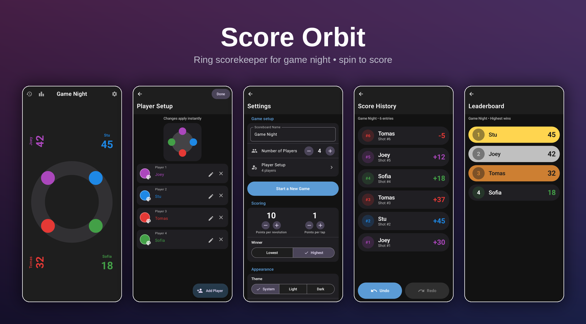
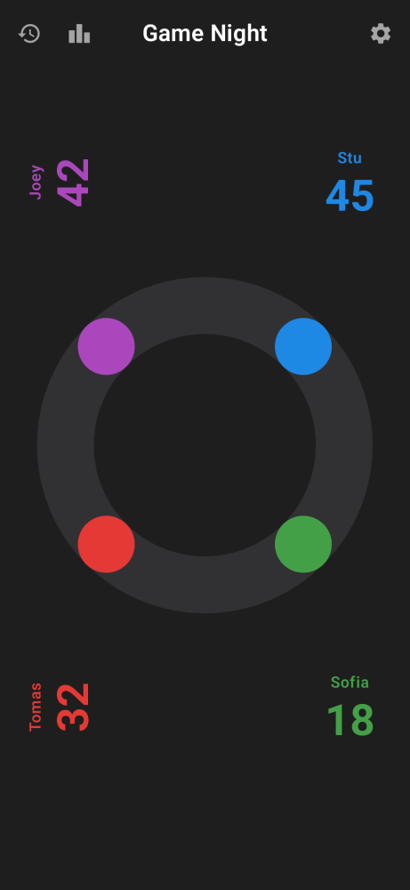
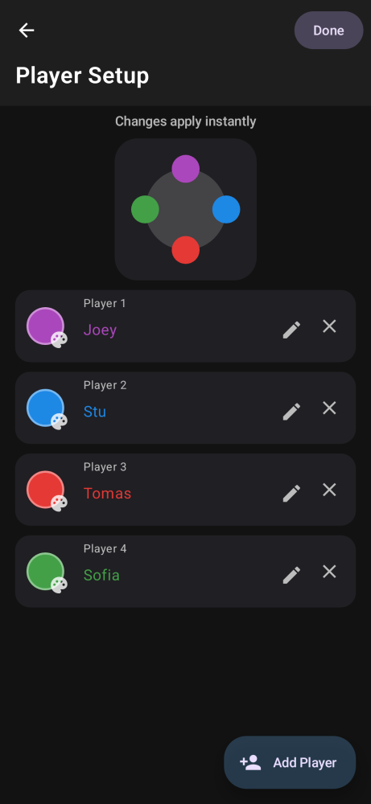
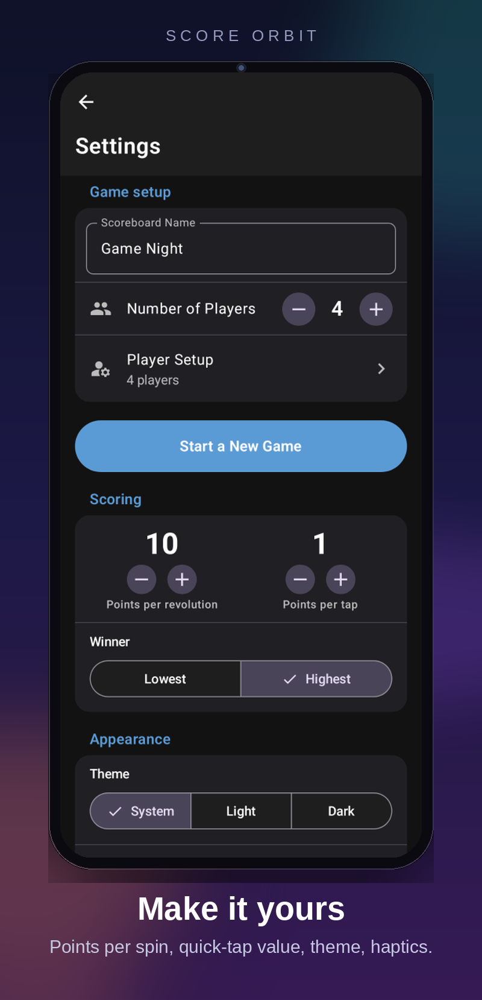
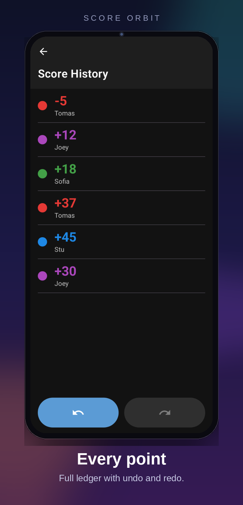
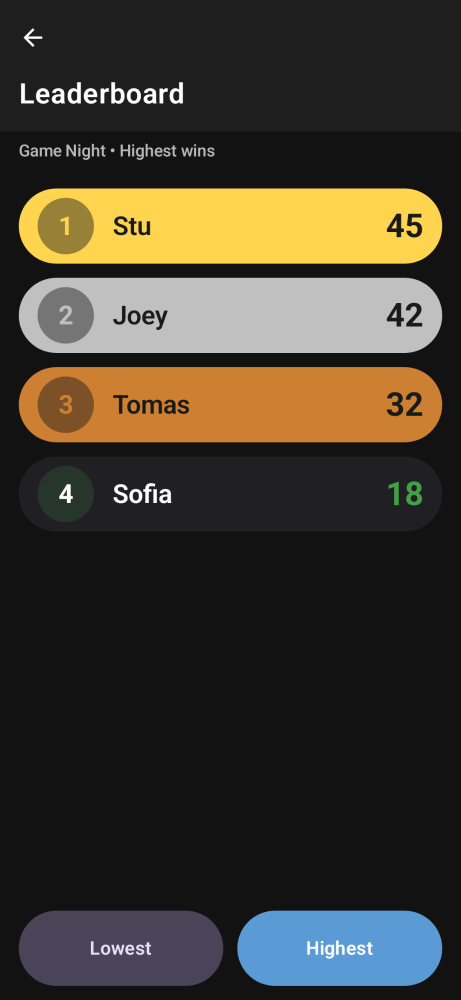

# Score Orbit

A scorekeeper for game night on Android, inspired by the Score Anything app on iOS.

The problem it solves is a familiar one: keeping score on paper means hunting for a pen, doing arithmetic between turns, and squinting at someone's handwriting. Score Orbit puts every player on a shared dial. To score, you drag around the ring the way you'd dial an old rotary phone — a full turn adds your configured points, and letting go snaps the dial back with a spring. Tapping a dot scores a smaller quick amount instead, and tapping a score rotates it so the player across the table can read it.



## How a game goes

You set up 1–12 players with names and colors, choose how many points a full revolution and a tap are worth, and whether the highest or lowest score wins. Then you just play — the board stays on the table and anyone can reach over and dial in their own points.

Scores land in a running ledger with undo and redo, so mis-taps are one button press to fix. When the game ends, the leaderboard ranks everyone with medal highlights for the top three.

<p align="center">
  
  
  
</p>
<p align="center">
  
  
</p>

## Details worth knowing

- **Tabletop-first layout.** Scores sit outside the ring facing their seat, and each dial dot parks near its own score. The board adapts from a full grid at 12 players down to a single dial.
- **Adaptive everything.** Follows the system light/dark theme (or override it), picks up Material You dynamic colors on Android 12+, and haptic feedback with adjustable strength.
- **Built with Material 3 Expressive** components throughout: collapsing app bars, tonal buttons, segmented controls, and spring physics on the dial itself.

## Build

```bash
./gradlew assembleDebug
```

Debug APK lands at `app/build/outputs/apk/debug/app-debug.apk`.

Release needs the local keystore in `~/.local/share/score-orbit/` (not in the repo):

```bash
./gradlew assembleRelease
```

Screenshots are generated headless with Paparazzi:

```bash
./gradlew recordPaparazziDebug
```
