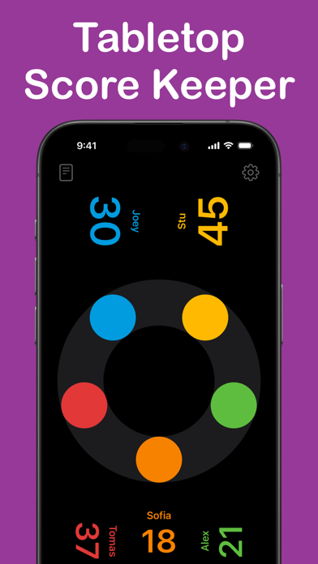
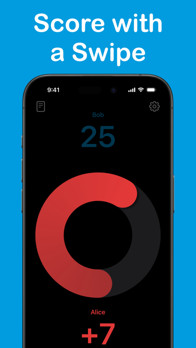
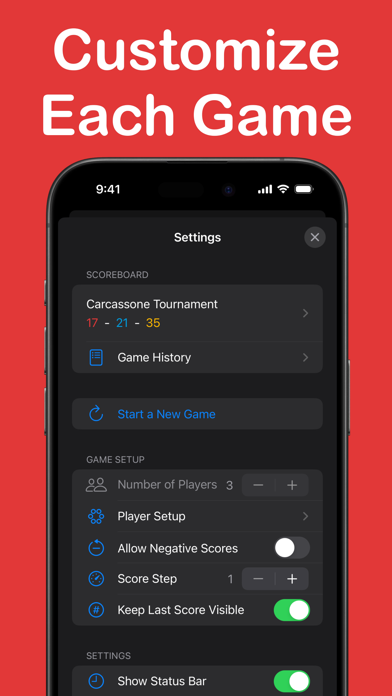

# Simple Scoring

An Android-native scorekeeper for board games and casual play. Every player
is a colored dot on a ring, scores sit out by the screen edges facing their
player, and points are kept with a circular rotary-dial gesture that unwinds
with a spring return.

The app comes in two visual versions:

## iPhone theme

The tabletop look: dark board, tonal menus.

| Scoreboard | Swipe scoring | Setup |
| --- | --- | --- |
|  |  |  |

Get it from the [v0.3-iphone release](https://github.com/hannad4/simple-scoring/releases/tag/v0.3-iphone).

## Material Expressive theme

Native Android Material 3 Expressive design: dynamic color, expressive
shapes and type, springy motion, bottom app bars, segmented controls, and
light mode that follows the OS theme.

| Scoreboard | Settings | Score history |
| --- | --- | --- |
|  |  |  |

Get it from the [v0.4 release](https://github.com/hannad4/simple-scoring/releases/tag/v0.4).

## Features

- 1–12 players with custom names and 24 dot colors
- Rotary swipe scoring: full turn = 10× step, either direction
- Tap a score to rotate it toward its player; tap a dot for quick +step
- Undo / redo with a per-game score ledger
- Highest- or lowest-wins, adjustable step, Material You dynamic color

## Technical

Android Kotlin + Jetpack Compose (Material 3).
Package: `com.simplescoring.android`

## Build

```bash
./gradlew assembleDebug
```

The debug APK is produced at `app/build/outputs/apk/debug/app-debug.apk`.

Headless UI screenshots (used above) regenerate with:

```bash
./gradlew recordPaparazziDebug
```
