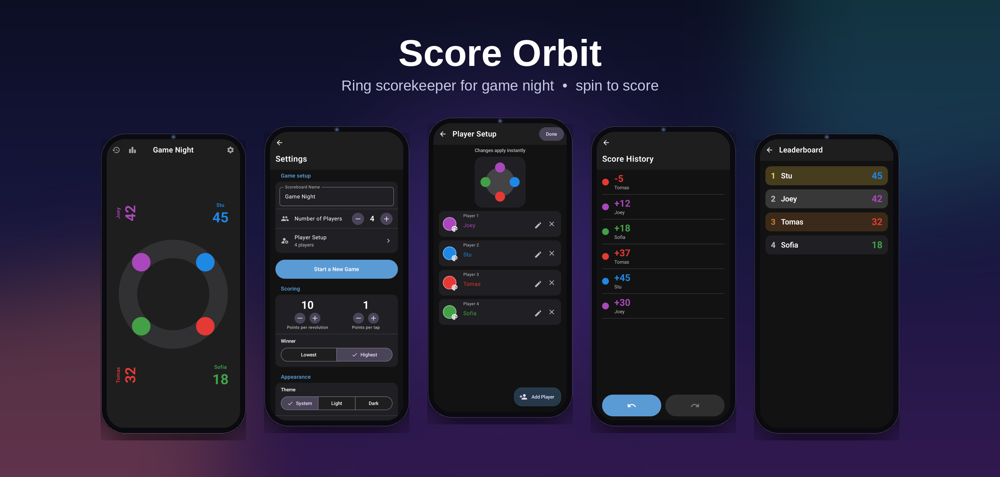
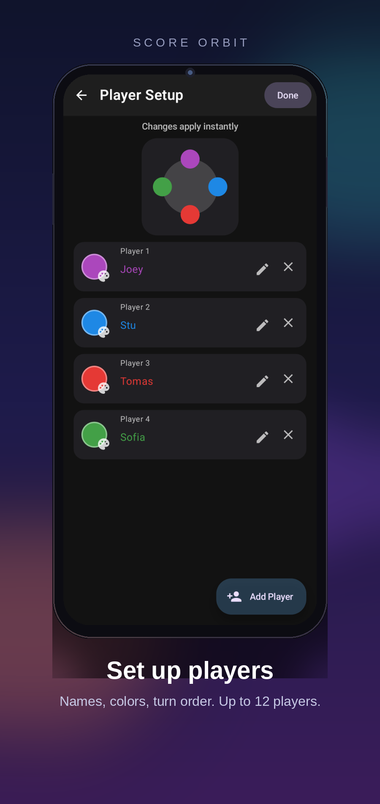
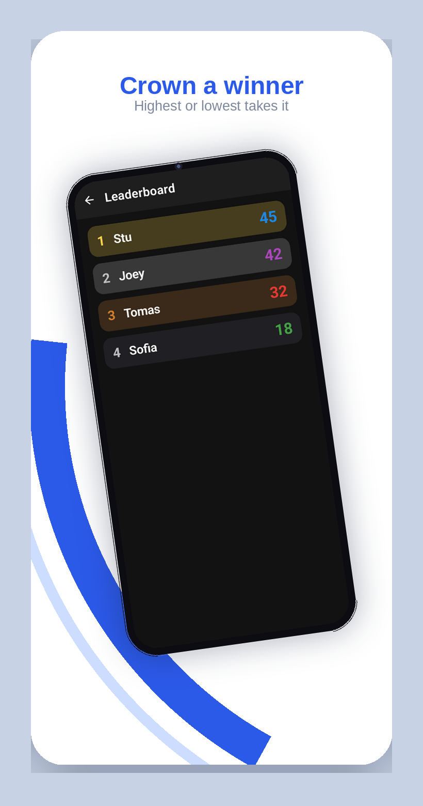

# Score Orbit

Keeping score on paper kills the vibe, so I built this for our game nights. Everyone gets a colored dot on a ring, scores sit out by the edges facing their seat, and you add points by dragging in circles like an old rotary dial. It unwinds with a little spring when you let go.

Inspired by the Score Anything app on iOS — I wanted the same feel as an Android-native app.



## How it plays

Set up 1–12 players with names and colors, pick how many points a full spin is worth, then just spin. Tapping a dot gives quick points (separate value for that). Tapping a score turns it toward its player so people across the table can read it.

Undo/redo is there for the usual "wait, that was supposed to go to Sofia" moments, there's a ledger of every entry, and a leaderboard that handles highest- or lowest-wins depending on the game.

| | | |
|---|---|---|
|  |  |  |
|  |  | |

Small stuff that matters: light/dark/system theme with dynamic color, haptic feedback with adjustable strength, Material 3 Expressive throughout.

## Build

```bash
./gradlew assembleDebug
```

Debug APK lands at `app/build/outputs/apk/debug/app-debug.apk`.

Release needs the local keystore in `~/.local/share/score-orbit/` (not in the repo):

```bash
./gradlew assembleRelease
```

Screenshots are generated headless with Paparazzi, then framed by `make_mockups.py` into what's in `docs/`:

```bash
./gradlew recordPaparazziDebug
```
